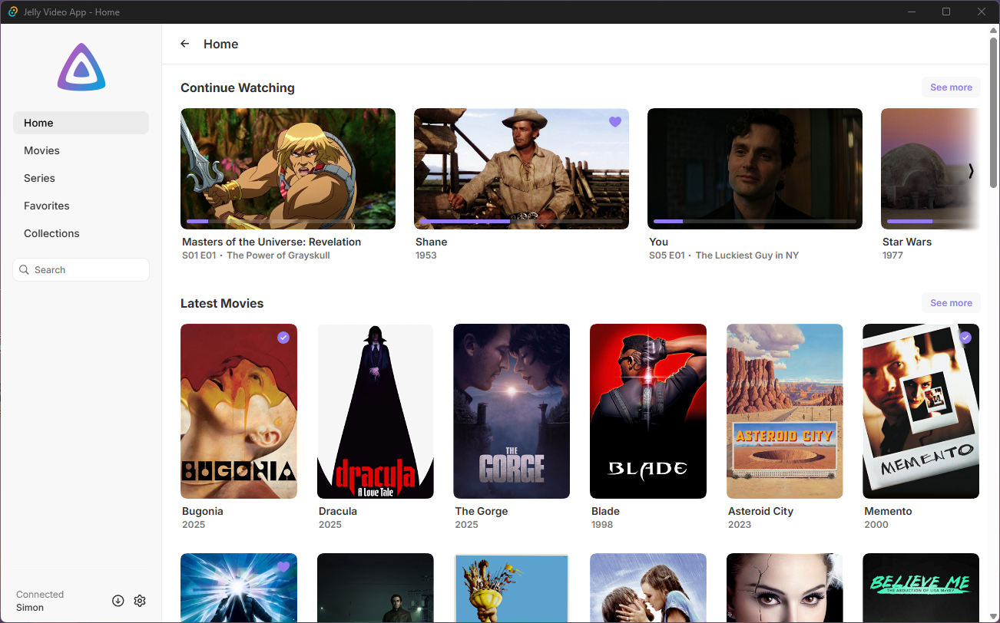
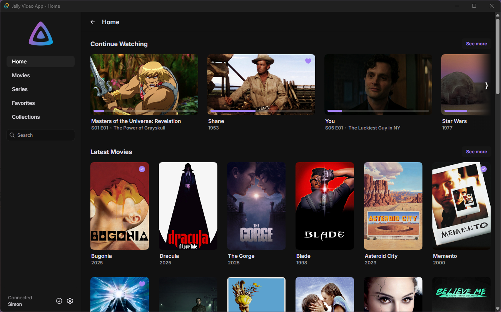
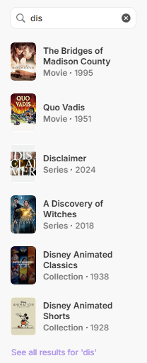
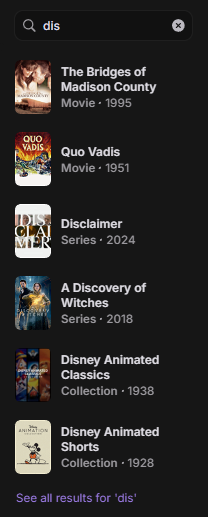
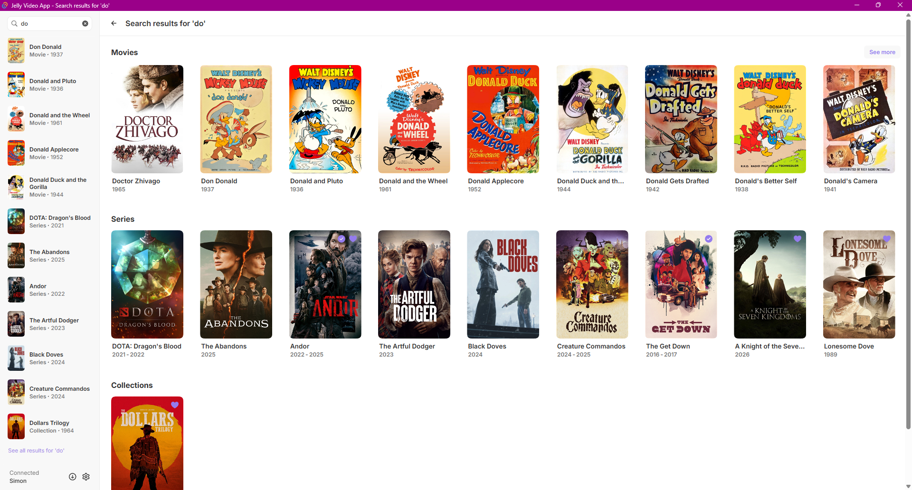
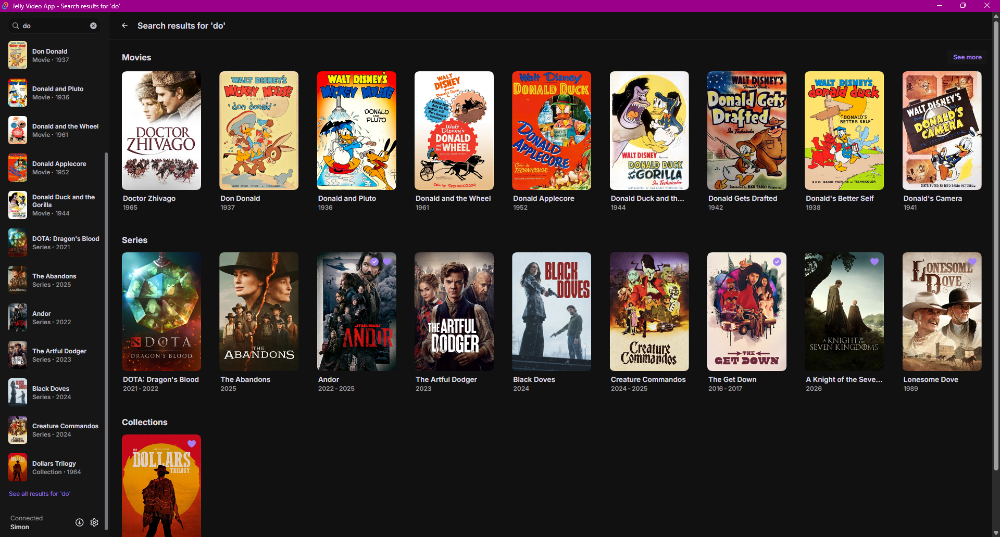
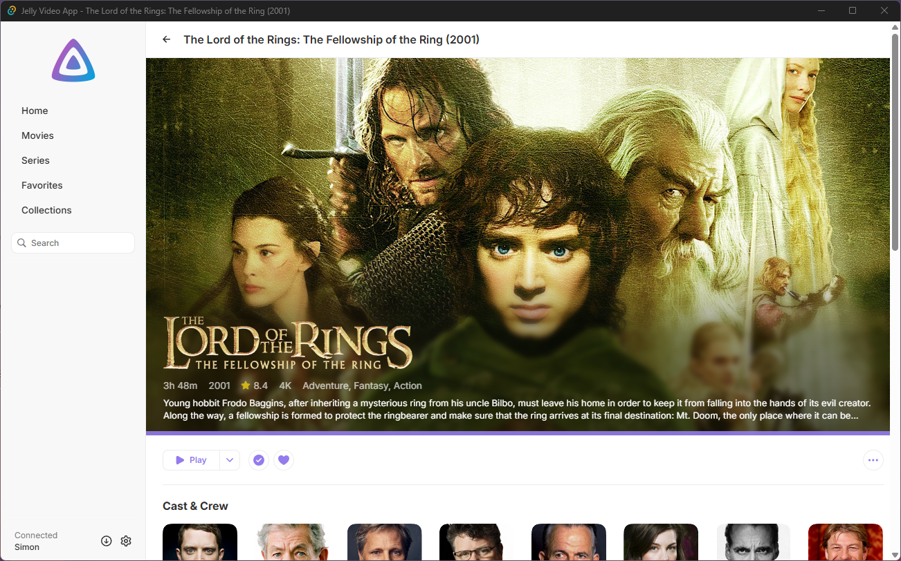
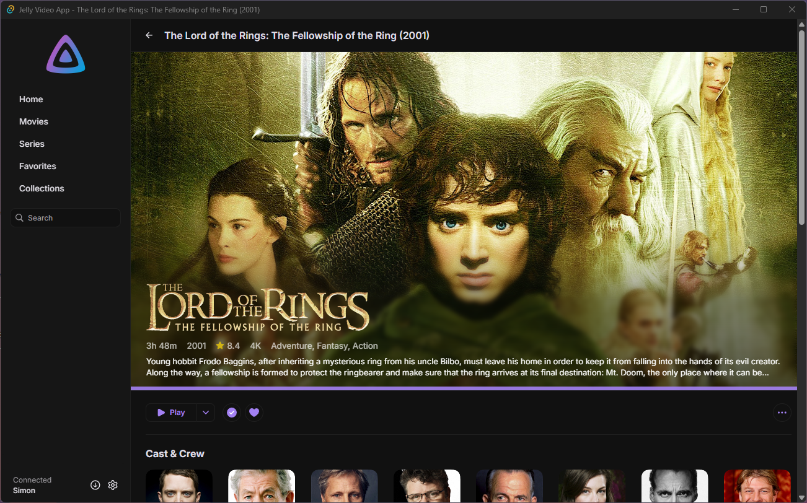
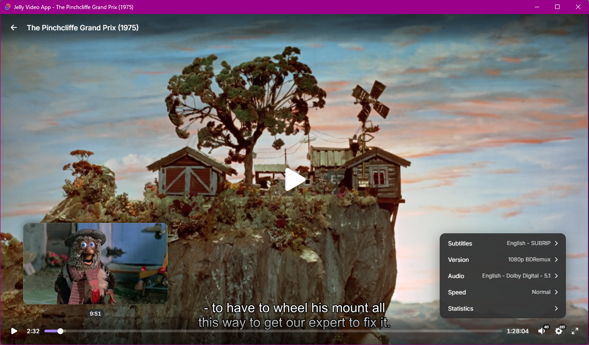

## Jelly Video App

A lightweight & elegant video client for Jellyfin, designed to eliminate server transcoding through direct playback powered by the mpv backend. Built with Tauri and libmpv for high-performance video playback with a clean, intuitive interface. Using the Jellyfin API, it provides seamless access to your personal video library.

**Looking for a music player?** Check out [Jelly Music App](https://github.com/Stannnnn/jelly-app/) - the music-focused web app for your Jellyfin library!

<div>
  
  
</div>
<details>
  <summary>Additional screenshots</summary>
  <br/>
  <b>Sidenav search</b>
  <p>Search for movies, tv shows, collections</p>
  
  
  <br/>
  <br/>
  <b>Search results</b>
  <p>View additional search results in a dedicated window</p>
  
  
  <br/>
  <br/>
  <b>Media Pages</b>
  <p>Beautifully crafted media pages</p>
  
  
  <br/>
  <br/>
  <b>Player</b>
  <p>Elegant player interface</p>
  
</details>

### Features

- **Native Performance:** Built with Tauri for a lightweight, native desktop experience with minimal resource usage.
- **Simple Design:** A clean, modern interface focused on smooth content discovery and playback.
- **Direct Playback:** Powered by libmpv for reliable, hardware-accelerated video playback.
- **Seamless Library Access:** Connect to your Jellyfin server to access your personal video collection with ease.
- **Discover Your Favorites:**
    - **Home:** Continue watching where you left off, discover new movies and tv shows, and see what's next up.
    - **Adventure:** Explore your media through a journey of beautifully crafted visuals, quick, digestible information, and smart recommendations, a stunning new way to experience your library.
    - **Quick Search:** Find movies, tv shows, or collections effortlessly using the convenient side navigation.
    - **Collections:** Browse existing curated collections, or create new collections for your media.
    - **Specials:** Specials are available and can be played or viewed from individual movie and tv show pages.
- **Versions:** Multiple versions of media are fully supported - you can choose a version before starting playback or within the video player.
- **Downloads:** Download individual media for offline playback, with support for multiple versions.
- **Elegant Player:** Extensive but clean player interface allowing you to change video, audio, and subtitle streams on the fly. For tv shows, an episode list for the current season is available, along with a next episode display at the end (using chapters). Trickplay preview thumbnails are fully supported.

### Installation

Jelly Video App is available as a native desktop application, available on our [GitHub release page](https://github.com/Stannnnn/jelly-video-app/releases).

> [!NOTE]
> Unfortunately, Windows is currently the only supported platform for video playback, as Linux & Mac have issues with the mpv backend. [Reference](<https://docs.rs/crate/tauri-plugin-libmpv/latest#:~:text=unlisten()%0A//%20await%20destroy()-,Platform%20Support,-Platform>).

<br />

[Yarn](https://classic.yarnpkg.com/lang/en/docs/install) (`npm i -g yarn`) is required if you wish to build the project or run the development server yourself.

#### Prerequisites

Before building or running Jelly Video App, you need to install the required dependencies:

1. **Tauri Prerequisites:** Follow the [Tauri Prerequisites Guide](https://v2.tauri.app/start/prerequisites/) for your platform.

2. **libmpv Plugin:** Install the tauri-plugin-libmpv dependencies by following the [official installation guide](https://docs.rs/crate/tauri-plugin-libmpv/latest).

#### Build from Source

1. Clone the repository:
    ```bash
    git clone https://github.com/Stannnnn/jelly-video-app.git
    ```
2. Install dependencies:
    ```bash
    yarn
    ```
3. Run the development server:
    ```bash
    yarn tauri:dev
    ```
4. Build the production application:
    ```bash
    yarn tauri:build
    ```

The built application will be available in `src-tauri/target/release/bundle/`.

### Development

- `yarn dev` - Start the Vite development server
- `yarn tauri:dev` - Start the Tauri development app with hot-reload
- `yarn build` - Build the web frontend
- `yarn tauri:build` - Build the complete Tauri application
- `yarn lint` - Run ESLint to check code quality

### Contributing

We're open to pull requests, please merge them to the `develop` branch. If you have any suggestions or improvements, feel free to open an issue or submit a pull request. Your contributions are welcome and appreciated!
